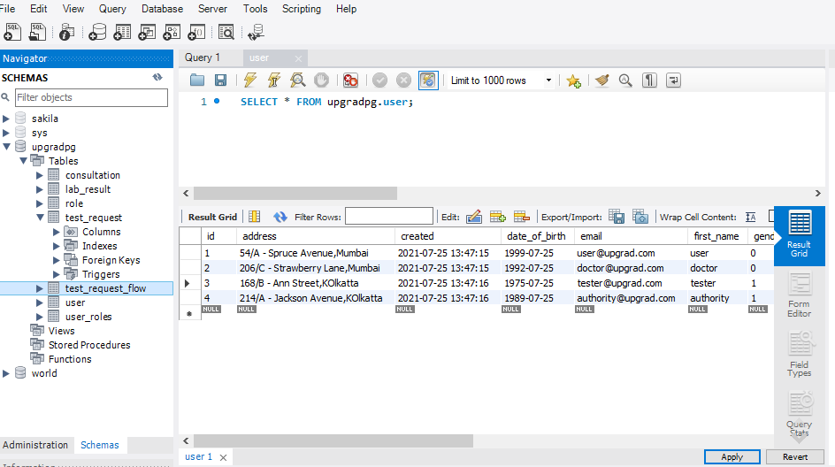
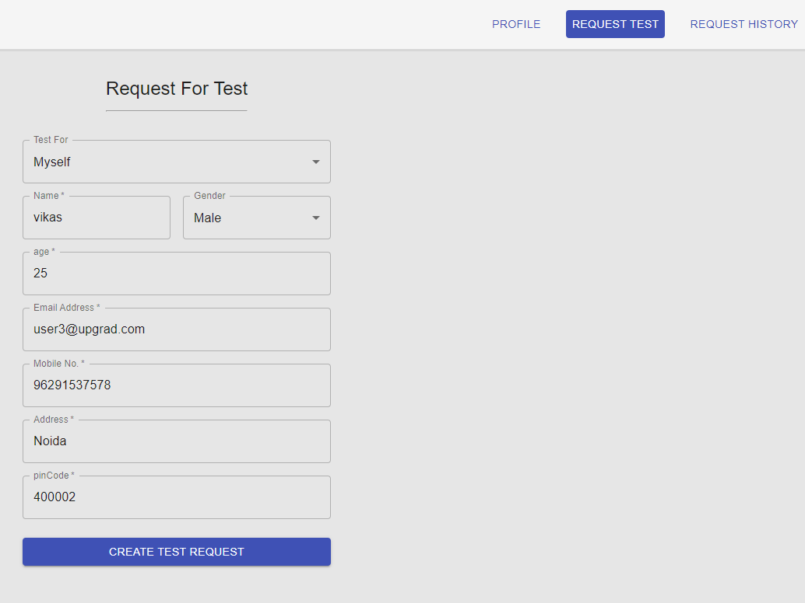
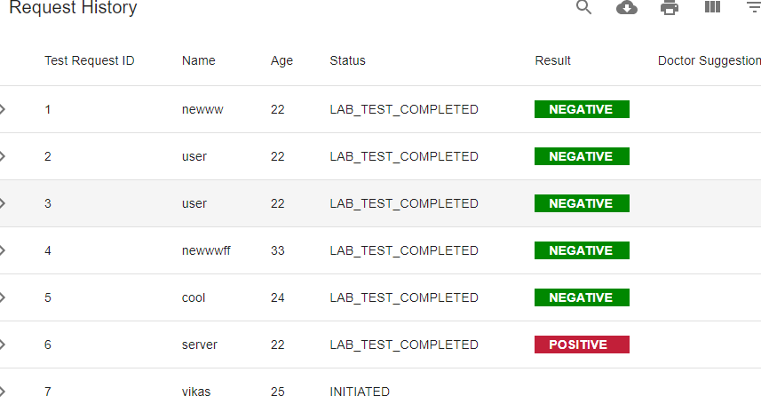
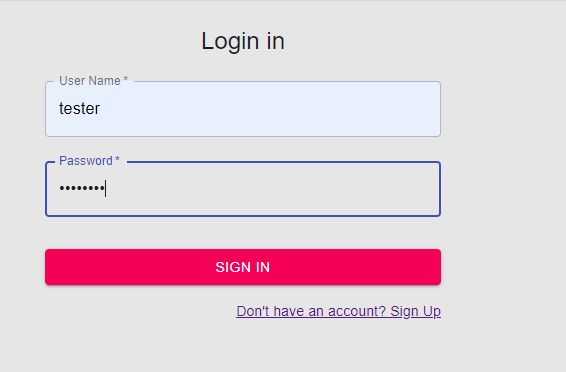
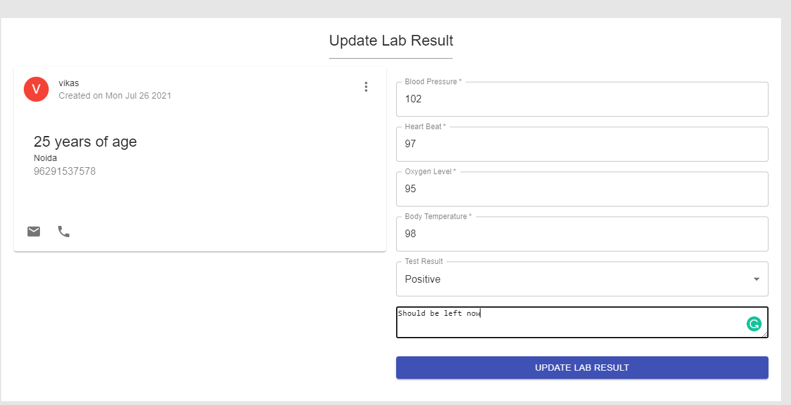
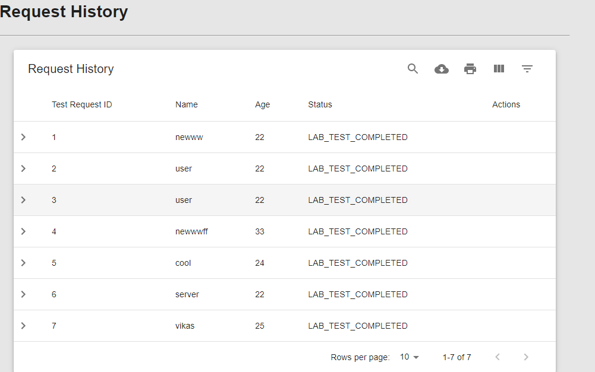
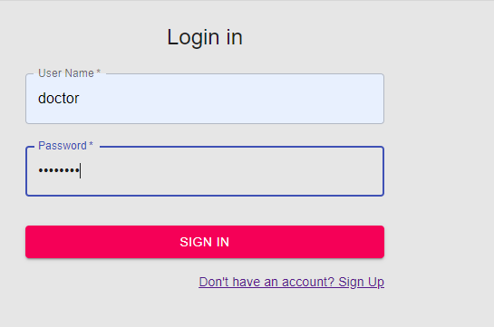

# techcontentprojects-upgrad.com
# Snapshot of project front end to backend

# connected to the workbench mysql

# Login in User

# create the Test Request

# Request History vikas has been INITIATED

# Login in Tester

# Pending Tests

# Assign to yourself

# Update Lab Result

# Status LAB_TEST_COMPLETED

# Login in Doctor

# Consultations Request

